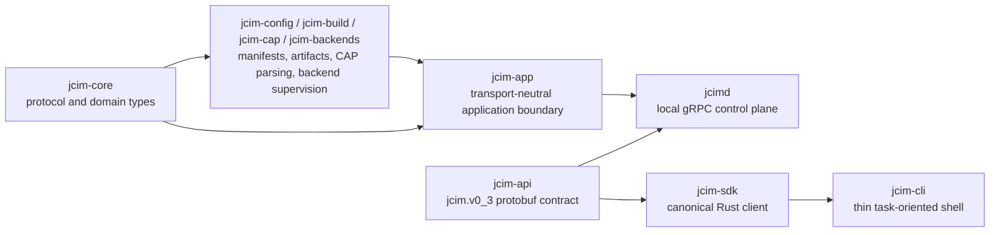

# Architecture Overview

JCIM 0.3 keeps the existing product center of gravity:

- simulator-first
- service-first
- transport-neutral application logic
- thin CLI shell
- canonical Rust SDK over the same daemon contract

## Layering

## Maintained Boundaries

- `jcim-app` is the transport-neutral application boundary for project, build, simulation, card,
  and system flows.
- `jcimd` is the single local control plane and owns the Unix-domain socket plus runtime metadata.
- `jcim-sdk` is the canonical Rust client over the maintained `jcim.v0_3` service contract.
- `jcim-cli` remains a thin task-oriented shell and keeps `jcim-cli.v2` as its maintained JSON
  automation contract.

## App-State Ownership

`AppState` is the ownership root for machine-local config, registry, simulations, build events,
and card sessions. The final 0.3 decision is to keep the synchronous store-helper model rather
than actorizing this state.

The invariants are:

- no lock guard is held across `.await`
- backend handles are cloned out before async work
- simulation startup follows reserve -> backend startup -> commit running or failed state
- retained simulation/build/card state is mutated through store helpers instead of ad hoc map
  access in feature modules

## Simulator-First Posture

- The maintained simulator path is project-backed, class-backed, and managed-Java through the
  bundled `jcardsim` posture.
- CAP artifacts remain first-class build outputs for card install, inspection, and debugging, but
  they are not the maintained simulator startup input.
- Physical-card workflows remain in scope, but they stay secondary to the simulator path.

## Contract Baseline

- protobuf package: `jcim.v0_3`
- CLI JSON schema: `jcim-cli.v2`
- managed files: `jcim.toml`, `config.toml`, `projects.toml`, `jcimd.runtime.toml`
- supported maintained hosts: Linux/macOS on `x86_64` and `aarch64`
- unsupported-host Java fallback: explicit `jcim system setup --java-bin /path/to/java`

The protobuf source intentionally remains a single governed file at
`crates/jcim-api/proto/jcim/v0_3/service.proto` for the 0.3 cycle.
